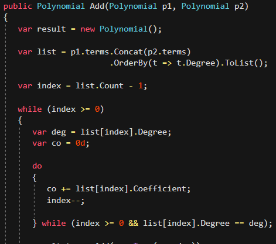

# Line Press

With Line Press you can control line height, 
and compress empty or any unimportant lines. 
More code. No cram.

<!-- Replace this badge with your own-->

<!-- Update the VS Gallery link after you upload the VSIX-->
Download this extension from [Visual Studio Marketplace](https://marketplace.visualstudio.com/items?itemName=OmarRwemi.LinePress)

Download the latest build from [VSIX Gallery](http://vsixgallery.com/extension/13d97f3e-75e2-4715-a444-715b5f39f0a4/)

---------------------------------------

**More code. No cram.**

 

**Have control.**

[change log](CHANGELOG.md)

##
**License**
[Apache 2.0](LICENSE