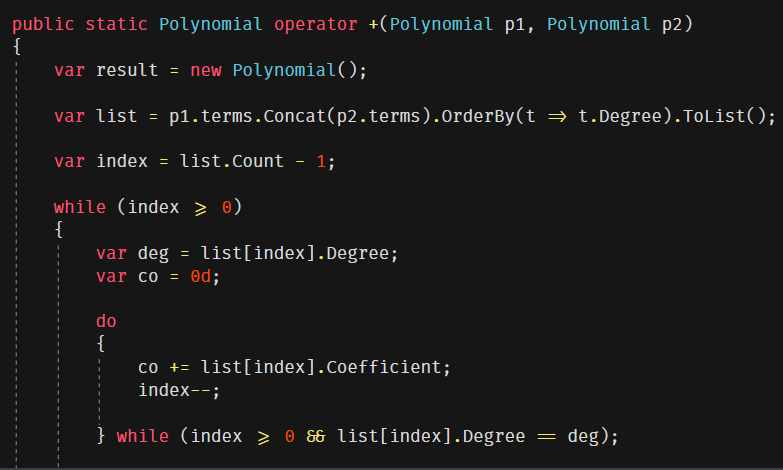
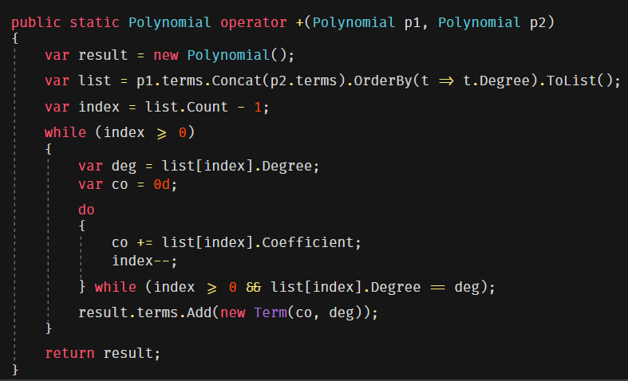
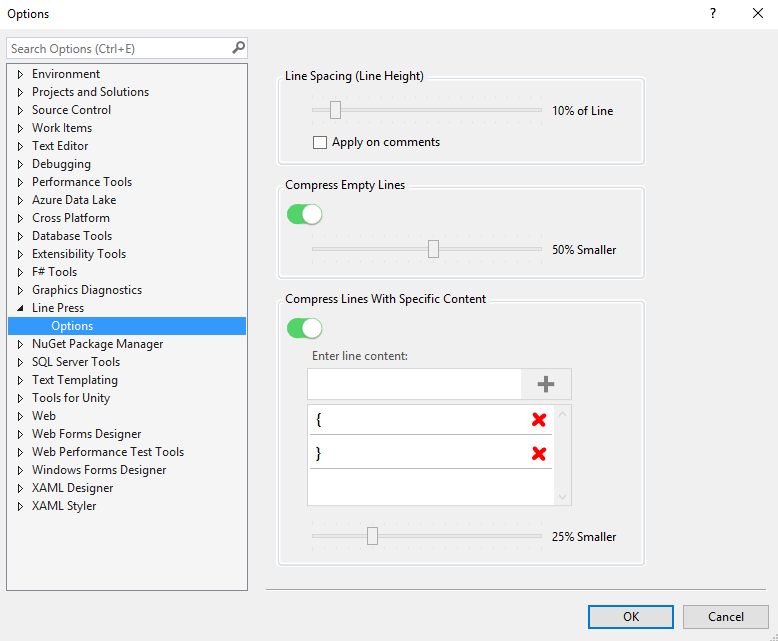

# Line Press

**Line Press** is a Visual Studio extension that allows you to control the height of empty lines and curly braces. 
 Reclaiming vertical space to display more code.

<!-- Replace this badge with your own-->

<!-- Update the VS Gallery link after you upload the VSIX-->
Download this extension from [Visual Studio Marketplace](https://visualstudiogallery.msdn.microsoft.com/[GuidFromGallery])

Download the latest build from [VSIX Gallery](http://vsixgallery.com/extension/13d97f3e-75e2-4715-a444-715b5f39f0a4/)

---------------------------------------

#### Without Line Press

#### With Line Press

#### Settings

See the [change log](CHANGELOG.md) for changes and road map.

## License
[Apache 2.0](LICENSE)